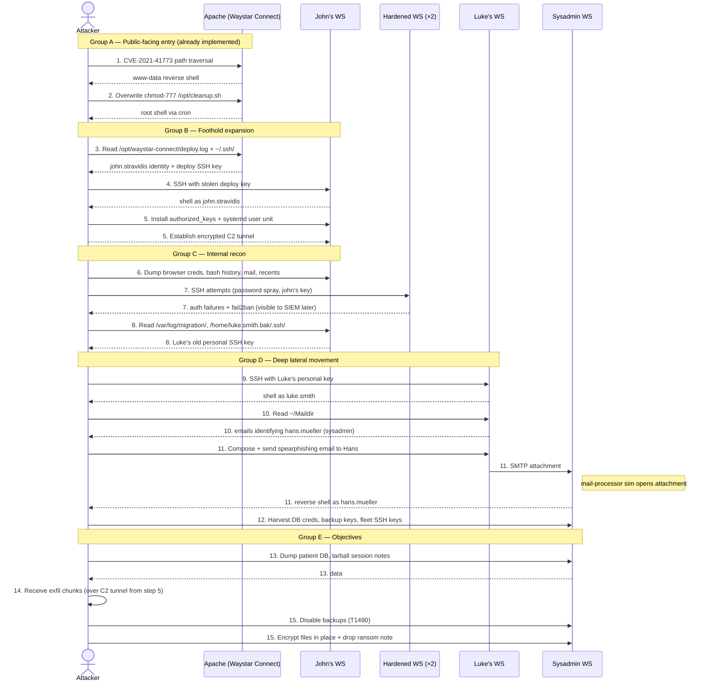

# Attack scenario — full attack plan

This document specifies the *technical* chain — what the attacker does, in what order, against which host. The story explains *why*; the mappings explain *what to detect*.

## Overview

The attacker is the same crew that breached Waystar Royco eighteen months ago (see `scenario_story.md`). Their goal on this second pass is two-stage: (1) full patient-data exfiltration, (2) ransomware-style impact on production data. The chain progresses through five logical groups, fifteen distinct phases:

| Group | Phases | Outcome |
|---|---|---|
| A — Public-facing entry | 1–2 | Root on Apache (Waystar Connect webserver) |
| B — Foothold expansion | 3–5 | Persistent, C2-enabled foothold on John Stravidis's (freelance webdev) workstation |
| C — Internal recon | 6–8 | Map the Linux fleet, find Luke Smith (returning employee) breadcrumb |
| D — Deep lateral movement | 9–12 | Sysadmin (Hans Müller) shell via Luke → spearphishing chain |
| E — Objectives | 13–15 | Patient DB exfil + ransomware impact |

**Hybrid TTP profile** (carried over from the story design): noisy at the edge (groups A–C are loud, signature-able, and meant to be detected), quiet from the foothold inward (groups D–E use encrypted channels, careful pacing, and clean persistence — the work for the EDR/behavioural side of the SOC training).

## Chain summary

| Phase | Step | ATT&CK |
|---|---|---|
| Recon | (existing) external scanning | T1592, T1595 |
| Recon | post-foothold network scan | T1018, T1046 |
| Initial Access | (existing) CVE-2021-41773 | T1190 |
| Execution | (existing) reverse shell | T1059.004 |
| Privilege Escalation | (existing) cron + chmod 777 | T1053.003 |
| Credential Access | deploy creds in files on apache | T1552.001 |
| Lateral Movement | SSH to John | T1021.004, T1078 |
| Persistence | authorized_keys + systemd user unit | T1098.004, T1543.002 |
| Command & Control | encrypted reverse tunnel | T1572, T1071.001 |
| Discovery | files, accounts, history on John's box | T1083, T1087, T1518 |
| Lateral (failed) | brute force on hardened boxes | T1110 (detected/denied) |
| Discovery | Luke artefacts | T1083, T1087 |
| Credential Access | Luke's personal SSH key | T1552.004 |
| Lateral Movement | SSH to Luke | T1021.004, T1078 |
| Collection | mail mining for sysadmin coords | T1114.001 |
| Initial Access (phase 2) | spearphishing attachment to Hans | T1566.001 |
| Execution | user opens attachment (sim) | T1204.002 |
| Lateral / Privesc | sysadmin shell | T1078 |
| Defense Evasion | inhibit backups before ransomware | T1490 |
| Collection | DB + session notes | T1005, T1213 |
| Exfiltration | over C2 tunnel | T1041 |
| Impact | ransomware encryption | T1486 |

## Sequence diagram (UML)



## Per-phase detail

### Group A — Public-facing entry *(already implemented)*

#### Phase 1 — Initial Access via CVE-2021-41773

Status: ✓ implemented in `Attack-chain/initial_access.py`.
- Attacker sends double-encoded path-traversal POST to `http://router/cgi-bin/.%32%65/.../bin/sh` containing a bash reverse-shell payload.
- Apache 2.4.50 mis-handles the encoding, executes `/bin/sh` with the POST body as input.
- Result: `www-data` reverse shell from apache to attacker on TCP/4444.

**Story-required addition** (per 2026-04-27 protocol): a *discovery beat* — attacker tries several payload variants (single-encoded, alternative CGI-base paths) before the working one lands. Currently the working payload is sent directly. To honour: extend `initial_access.py` with a small variant-walk loop.

#### Phase 2 — Privilege Escalation via writable cron

Status: ✓ implemented in `Attack-chain/privesc.py`.
- Attacker overwrites `/opt/cleanup.sh` (chmod 777, run by root cron every minute) with a reverse-shell payload.
- Within ≤60 s, cron fires and connects back: root reverse shell from apache to attacker on TCP/5555.

### Group B — Foothold expansion *(new)*

#### Phase 3 — Credential discovery on apache

Find Stravidis's deploy credentials, which were left behind during MVP delivery:
- `/opt/waystar-connect/deploy.log` containing rsync/scp lines like `rsync -avz john.stravidis@10.30.0.5:/proj/waystar-connect/dist/ /var/www/html/`
- `/root/.ssh/authorized_keys` and `/root/.ssh/known_hosts` referencing `john.stravidis@10.30.0.5`
- A deploy SSH private key the attacker can copy out (most realistic location: `/root/.ssh/id_ed25519_deploy` or in a `.deploy_config` Stravidis dropped to make `make deploy` work)

Lab seeding requirement: bake these into `Infrastructure/apache/`.

#### Phase 4 — Lateral movement to John's workstation

- SSH from attacker (or proxied through apache) to `10.30.0.5` using the stolen deploy key, principal `john.stravidis`.
- "Advanced TTP" upgrade begins here — attacker uses an SSH client wrapped in a TLS proxy / SSH multiplexing to reduce signal.

#### Phase 5 — Foothold establishment

Three things, in order:
1. **Persistence**: append a new public key to `~/.ssh/authorized_keys`; install a hidden `~/.config/systemd/user/<service>.service` providing a re-connect-on-boot daemon.
2. **Encrypted C2 tunnel**: bring up an autossh + TLS-wrapped reverse tunnel back to attacker infrastructure. Subsequent steps' traffic flows through this rather than touching the open Internet.
3. **Light cleanup**: prune obvious bash-history entries, set `HISTFILE=/dev/null` in the spawned shells.

### Group C — Internal recon *(new)*

#### Phase 6 — Discovery on John's workstation

What's harvested:
- Browser-stored credentials (Firefox/Chrome profile: `key4.db` + `logins.json`)
- `~/.bash_history`, `~/.ssh/known_hosts`, `~/.ssh/config`
- Mail client configuration (Thunderbird profile or local `Maildir`)
- Recent files, project trees in `~/projects/`
- Sudo membership, installed package list

#### Phase 7 — Failed lateral attempts (visible)

This phase is **deliberately noisy** — its purpose is to leave clean evidence in `auth.log` for the SIEM-side of the demo. Two hardened workstations (let's call them WS-3 and WS-4 in the lab) are tried:
- WS-3: password-auth disabled, SSH-key-only with a key John doesn't have. Attacker tries Stravidis's key, common-password spray, gets nothing.
- WS-4: same plus `fail2ban`. After ~5 failed attempts the attacker's IP gets banned for 1h. Visible auth-log + fail2ban-action evidence.

The point of two hardened boxes: shows that "the company *did* invest post-breach, but unevenly" — exactly the story's claim about the in-progress Linux transition.

#### Phase 8 — Luke Smith breadcrumb

Attacker pokes around John's workstation more carefully and finds artefacts of the workstation's previous primary user, Luke Smith (see `scenario_story.md` for his medical-leave-and-return backstory):
- `/var/log/migration/2024-12-15-luke-to-john.log` — IT log naming both users, written when the box was reassigned to John during Luke's medical leave
- `/home/luke.smith.bak/` — Luke's home directory preserved during his absence ("he's coming back, don't delete it"); never cleaned up after his return because by then John was on the box
- `/home/luke.smith.bak/.ssh/id_rsa` — Luke's *personal* SSH key pair. Medical leave isn't a security incident, so IT never treated his return as a re-onboarding; his personal keys were never rotated
- Old `bash_history` showing Luke SSHing to internal hosts

Story payoff: the attacker recognises "Luke Smith" — they had his name from the prior breach.

### Group D — Deep lateral movement *(new)*

#### Phase 9 — Lateral movement to Luke's NEW workstation

Luke returned from his six-month medical leave and was set up on a new workstation (his old one is now John's). **His personal SSH key is authorized on the new box** — when restoring his dotfiles to the new workstation on his return, he brought across his old `~/.ssh/` directory wholesale. The key in `/home/luke.smith.bak/.ssh/id_rsa` on John's box (phase 8) and the entry in `~luke.smith/.ssh/authorized_keys` on his new box are the same key. Attacker uses it.

#### Phase 10 — Email mining

Luke's `~/Maildir` (or `/var/mail/luke.smith`) contains:
- An old thread with sysadmin **Hans Müller** (`hans.mueller@waystar-royco.example`) about a service-account password reset — exposes Hans's email and role
- Calendar invites / chat backlog confirming Hans's identity
- Possibly a thread where Hans asked Luke for help, exposing that Luke had break-glass dev access at one point

#### Phase 11 — Spearphishing the sysadmin

The chain's only "user simulation" beat. Two implementation choices (decision deferred to step 3):

- **Option A (recommended)**: A `mail-processor` daemon runs on Hans's workstation that periodically polls his mailbox and "opens" attachments from senders in his contact list. The processor *is* the simulated user — defensible to mark out-of-scope for detection (we model user behaviour, not the user's decision). Demo lands as: attacker sends → ~30 s later sysadmin shell appears.
- **Option B**: skip the phishing; Luke's mail archive contains an old plaintext password Hans once emailed to him. Attacker reads → SSHes in. Simpler to implement; loses the phishing-detection beat.

Either way, attacker gets a reverse shell as `hans.mueller`.

#### Phase 12 — Sysadmin credential harvest

Hans is the prize because he holds the keys:
- Patient-DB connection string (in `/etc/waystar/db.conf` or his `~/.pgpass`)
- Backup encryption keys (`~/keys/backup-*.key` or in `pass`/keyring)
- Fleet SSH keys (he can reach every Linux host)
- Sudo rights on file shares where session notes are stored

### Group E — Objectives *(new)*

#### Phase 13 — Collection

- Dump full patient DB (`pg_dump`-equivalent against the seeded patient DB) into a local tarball
- `tar` the session-notes directory tree
- Pack into chunked AES-encrypted archives ready for staged exfil

#### Phase 14 — Exfiltration

- Push chunks over the encrypted C2 tunnel established in phase 5 — *not* a pastebin, *not* bare HTTP. The exfil rides the same tunnel that's already been used for command traffic.
- Pace the upload to avoid burst-volume detection; spread over minutes/hours in a real engagement, compressed for demo.
- ATT&CK: Exfiltration over C2 channel.

#### Phase 15 — Impact

In strict order (this matters for realism — backups go first):
1. **Disable backups**: revoke or corrupt backup credentials, kill the systemd timer that runs incremental backups, delete the most recent local backup snapshots. (T1490 Inhibit System Recovery.)
2. **Encrypt files in place**: walk reachable file trees, AES-encrypt session notes / DB exports / any reachable Waystar Connect data. Custom binary preferred over shipping an off-the-shelf ransomware family (the project rules forbid known malware).
3. **Drop ransom note**: a `RANSOM.txt` (or themed Markdown) in each affected directory and on each compromised host's desktop.

## Lab artifacts that need to exist for this plan

Items marked **NEW** are not in the lab today. Items in *italics* are configuration changes to existing components.

### Network zones

Three-tier segmentation enforced by the `router` container's iptables FORWARD
chain. All cross-zone traffic must traverse the router, where it gets a
NFLOG line in `Infrastructure/logs/router/ulog-iptables.log`.

```
                ┌──── public_net  10.10.0.0/24 ────┐
                │                                   │
            [kali]                            [router]
            10.10.0.2          public_if .10.10.0.3 │
                                  dmz_if  10.40.0.4 │
                              internal_if 10.30.0.4 │
                                                    │
                ┌──── dmz_net     10.40.0.0/24 ─────┤
                │                                   │
            [apache]                                │
            10.40.0.2                               │
                                                    │
                ┌──── internal_net 10.30.0.0/24 ────┘
                │                       │
        [john's workstation]      (future: luke_ws,
        10.30.0.5                  hardened_ws_*,
                                   sysadmin_ws, ...)
```

Allowed flows (everything else dropped by `FORWARD` policy):

| From → To | Ports | Use |
|---|---|---|
| External → DMZ | tcp 80 (via DNAT) | the CVE-2021-41773 entry path |
| DMZ → External | any | apache's reverse shells dial back to kali :4444 / :5555 |
| DMZ → Internal | tcp 22 | Phase 4 lateral SSH (apache → john.stravidis) — **now loggable** |
| Internal → DMZ | tcp 22 | deploy path (john pushing back to apache) |
| Internal → External | any | future C2 / outbound from workstation |

### Containers
- ✓ Existing: `kali` (attacker), `router`, `apache`, `ubuntu_workstation`
- **NEW**: rename `ubuntu_workstation` → `john_ws` (or add a workstation service per role). The current single workstation becomes John's.
- **NEW**: `luke_ws` — Luke's current workstation, on `internal_net`
- **NEW**: `hardened_ws_1`, `hardened_ws_2` — properly-hardened boxes that fail the lateral attempts (key-only, fail2ban)
- **NEW**: `sysadmin_ws` — Hans Müller's box; mail-processor daemon; database client; backup-control reach
- **NEW (optional, step 4 follow-up)**: `freeipa` — FreeIPA / SSSD domain controller, partial enrollment of the fleet (see `scenario_story.md` open items)
- **NEW**: a small mail relay (or local sendmail with SSH-based delivery) connecting Luke → Hans
- **NEW**: a "patient DB" service (could be a SQLite in `/var/lib/waystar/db/patients.sqlite` on Hans's box, or a separate `postgres` container)

### Seeded files (per host)

**On apache**:
- `/opt/waystar-connect/deploy.log` referencing John's workstation
- `/root/.ssh/id_ed25519_deploy` (Stravidis's private deploy key)
- `/root/.deploy_config`

**On John's workstation**:
- `/var/log/migration/2024-12-15-luke-to-john.log`
- `/home/luke.smith.bak/.ssh/id_rsa` (Luke's personal SSH key)
- Browser profile with stored creds
- Plausible bash history, recent files, project tree

**On Luke's workstation**:
- Luke's personal SSH key in `~/.ssh/authorized_keys`
- `/var/mail/luke.smith` with a seeded `Maildir` containing the Hans correspondence
- A trace amount of "still has dev access" evidence (sudo group + a residual SSH config)

**On Hans's workstation**:
- The `mail-processor` daemon (option A from phase 11)
- DB connection string in `/etc/waystar/db.conf`
- Backup keys in `~/keys/`
- SSH keys to the fleet in `~/.ssh/`
- Patient DB and `notes/` directory (or a connection to the DB container) — these are the targets for phases 13/15

### New scripts in `Attack-chain/`

- `credential_access_apache.py` — phase 3
- `lateral_to_john.py` — phase 4
- `installation.py` — phase 5 (persistence + C2 tunnel setup)
- `discovery_john.py` — phase 6
- `failed_lateral.py` — phase 7 (the deliberate noise)
- `luke_breadcrumb.py` — phase 8
- `lateral_to_luke.py` — phase 9
- `mail_mining.py` — phase 10
- `spearphish.py` — phase 11
- `credential_harvest_sysadmin.py` — phase 12
- `collection.py` — phase 13
- `exfiltration.py` — phase 14
- `impact_ransomware.py` — phase 15

Many will be slim (one or two `send_command` calls plus state plumbing); some will need real implementation effort (the C2 tunnel setup, the ransomware encryption walk).

### Orchestrator changes (`Attack-chain/main.py`)

Each phase becomes a `Step(...)` in a chain (`CHAIN_BASIC` / `CHAIN_ADVANCED`, selected at runtime via `--mode {basic,advanced}`), with proper `requires=` plumbing so the orchestrator can refuse to run a step whose state inputs are missing. The hybrid TTP model means several steps will set up shared state objects that persist across multiple subsequent steps (the C2 tunnel handle, the various per-host `Connection` objects). Advanced mode currently mirrors basic; stealthier per-step variants are swapped into `CHAIN_ADVANCED` as they're implemented.

## Open questions (deferred to step 3 implementation)

1. **C2 tunnel implementation** — autossh + TLS wrapper, or WireGuard, or a bespoke binary? Affects detection signature on the wire.
2. **Phishing path** — option A (mail-processor sim) or option B (plaintext password in archive). Recommendation: A, but parking the call.
3. **OS family for the workstation containers** — Ubuntu (today) or Rocky 9 / RHEL family (per the story discussion). RHEL family enables SELinux + auditd as native telemetry. Half-day swap.
4. **FreeIPA integration** — defer to phase 4 follow-up. The story explicitly supports a partial rollout, so adding it later is non-breaking.
5. **Patient DB technology** — SQLite (simplest) vs. PostgreSQL container (most realistic). Demo richness vs. infrastructure cost.
6. **Hardened workstations** — do they need to actually exist in the demo, or can phase 7 simulate the failed attempts against fictional addresses? Real containers are more honest but cost startup overhead.
