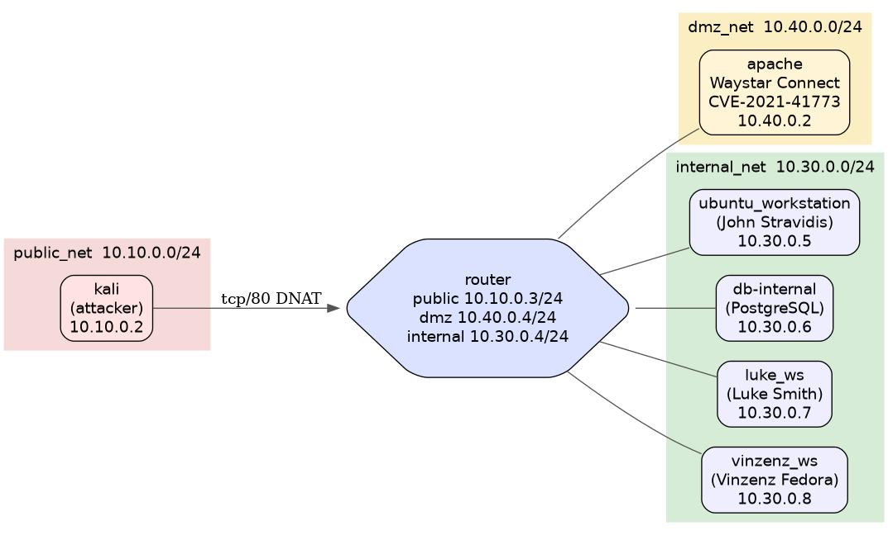

# Attack scenario

( _This repository was created from an original private repository to share the code publicly since the original one had internal data and secrets. The commit history has been preserved, but pull requests, issues, and other internal discussions have not been migrated._ )

This project is about an custom attack scenario to showcase IT security demonstrations.

Currently, it consists of an attacker client (Kali Linux), a router container that simulates the edge of the network, a victim webserver, victim Ubuntu workstations (one with an XFCE desktop), and an internal PostgreSQL database server (`db-internal`). The network is split into three router-controlled zones: `public_net` (attacker side), `dmz_net` (the webserver), and `internal_net` (workstations + database). All cross-zone traffic traverses the router, which forwards only port 80 inbound to the webserver.

## About the credentials in this repository

Everything in this repository is a self-contained, isolated lab. **Every credential, private
key, SSH key, password and certificate you find here is a deliberate prop** — planted so the
simulated attacker has something realistic to discover. That includes `.env` files, the
`shared-lab-keys/` SSH keys, the exfiltration keypair and the lab CA.

None of them are real, none of them grant access to any real system, and none of them should
be reported as a leaked secret. Automated secret scanners will flag some of them; that is
expected. The patient records, names and email addresses in the database are synthetic too.

The scenario is offensive tooling. Run it only inside the provided isolated Docker network,
never against systems you do not own or have written permission to test.

## Network topology



The Ubuntu workstation exposes its desktop on host port 5901 — connect with any VNC client (e.g. `vinagre`, `remmina`, `tigervnc-viewer`) to `localhost:5901`. No VNC password is set; this is a placeholder lab host. SSH (port 22) and the VNC server run side-by-side inside the container.

**Lab SSH credentials (intentionally weak — isolated lab use only):** `labuser` / `labpass`

```bash
ssh labuser@<ubuntu_workstation-IP>
```

## Services

| Container | Image | Network | Purpose |
|---|---|---|---|
| `router` | Ubuntu 22.04 | `public_net` + `dmz_net` + `internal_net` | Edge router; forwards port 80 to apache |
| `apache` | httpd:2.4.50 (vulnerable) | `dmz_net` | Waystar Connect webserver; CVE-2021-42013 target |
| `ubuntu_workstation` | Ubuntu 24.04 | `internal_net` | John Stravidis's dev workstation (VNC on port 5901) |
| `luke_ws` | Ubuntu 24.04 | `internal_net` | Luke Smith's workstation (psychiatrist, 10.30.0.7); read-only patient-DB client |
| `vinzenz_ws` | Ubuntu 24.04 | `internal_net` | Vinzenz Fedora's sysadmin workstation (10.30.0.8); cross-fleet SSH reach + superuser DB credentials |
| `db-internal` | postgres:16 | `internal_net` only | Waystar Royco patient database; Phase 12–13 target |
| `kali` | kali-rolling | `public_net` | Attacker machine |

## db-internal — patient database

`db-internal` runs PostgreSQL 16 on `internal_net` (10.30.0.6) with no outbound connectivity.

**Database:** `waystar`  
**Tables:** `patients` (80 records), `session_notes` (~100 records of fictional therapy sessions), `appointments` (inbound booking requests from the public-facing site; filled at runtime by the waystar-connect web form)

| User | Password | Access |
|---|---|---|
| `waystar` | *(privileged; stored on Vinzenz's workstation, `~/.pgpass`)* | Full owner |
| `waystar-readonly` | `ChangeMe!2026` | SELECT on all tables — breadcrumbed in John's `~/.pgpass` |
| `waystar-app` | `AppBooking!2026` | INSERT on `appointments` only (no patient data); used by the apache booking endpoint, stored in `apache:/etc/waystar/db.env` |

**Connecting from the workstation:**
```bash
# Credentials are picked up automatically from ~/.pgpass
psql -h db-internal -U waystar-readonly -d waystar
```

**Public-facing booking endpoint:**
The Waystar Connect site (served by `apache`) ships a Python CGI at `/cgi-bin/book.py`. It accepts a JSON booking payload, validates it server-side, and inserts a row into `appointments` as `waystar-app`. Patient data is **not** exposed through this surface — a compromised webserver lands on a least-privilege account.

**Logs** are written to `Infrastructure/logs/db/postgresql-YYYY-MM-DD.log` and persist across container restarts. Connection attempts, failed authentications, and data-modification statements are all logged — useful for SIEM/NIDS demo scenarios.

**Attack-chain role:** John's bash history and `~/.pgpass` breadcrumb the existence of this host (Phase 6 discovery). Phase 12 harvests the `waystar` privileged credentials from Vinzenz Fedora's sysadmin workstation (`vinzenz_ws`). Phase 13 exfiltrates the patient records via `pg_dump`. The `waystar-app` credentials on apache are an *additional* lateral surface but only reach `appointments`.

## Prerequisites

1. Docker needs to be installed on the system
2. Navigate into the `Infrastructure` folder

## How to run this project

```bash
docker compose up -d --build
```

Inbound access from the attacker side reaches the webserver only through the router's forwarded port 80; all cross-zone traffic is routed through the router.

To add more internal clients later, connect them to `internal_net`. Do not attach Kali to the DMZ or internal networks.

## Running the recon phase

The Kali container ships with `nmap`, `gobuster`, `ffuf`, `nikto`, `python3`, `sshpass`, and [`netexec`](https://www.netexec.wiki/) (manual-use credential-stuffing tool referenced from the `lateral` chain step), plus `wget` and `curl`. The `Attack-chain/` directory is mounted into the container at `/Attack-chain`, so `initial_recon_1.py` is runnable from inside.

```bash
# Option 1)
#Automated Orchestration of all phases and automated cleanup:
tools/run.sh                       # defaults to --mode basic
tools/run.sh --mode advanced       # stealthier APT-style variant (fileless Sliver C2,
                                   # sysadmin pivot to vinzenz_ws, in-place DB encryption + restore)
tools/run.sh --build               # rebuild images first — use after a `git pull`
                                   # that changed a Dockerfile or seeded file

# Option 2)
# Running the phases one by one:
# Full recon flow against the default target (router)
docker compose exec kali python3 /Attack-chain/initial_recon_1.py

# Override the target to the internal webserver instead of the default router
docker compose exec kali python3 /Attack-chain/initial_recon_1.py --target webserver

# Run a single phase
docker compose exec kali python3 /Attack-chain/initial_recon_1.py --phase gobuster

# Override the gobuster wordlist
docker compose exec kali python3 /Attack-chain/initial_recon_1.py --wordlist /usr/share/wordlists/dirb/small.txt
```

Results land in `Attack-chain/results/` (bind-mounted, persisted on the host):

| File | Source |
|---|---|
| `nmap-fullscan.txt` | `nmap -Pn -sS -p-` |
| `nmap-services.txt` | `nmap -Pn -sS -sV -sC -p <open-ports>` |
| `gobuster.txt` | `gobuster dir` against `dirb/common.txt` (override via `--wordlist`) |
| `ffuf.json` | extension fuzz on `/index<ext>` (JSON output from ffuf `-of json`) |
| `nikto.txt` | `nikto -Tuning b` |

## Logging & detection per phase

What the attacker does each chain phase and what the defender sees in a
host-persisted log (`Infrastructure/logs/`), with the MITRE ATT&CK IDs.

| Phase | Attacker | Defender log | ATT&CK |
|---|---|---|---|
| `recon` | scan/fuzz Kali → apache:80 | `logs/apache/{access,error,forensic_log}` (404 probe flood) | T1595, T1592 |
| `exploit` | CVE-2021-42013 traversal + www-data reverse shell | `logs/apache/access.log` (`cgi-bin/.%32%65/…/bin/sh` URI) | T1190, T1059.004 |
| `lateral` | SSH cred-stuffing apache → workstations | `logs/{luke_ws,vinzenz_ws}/auth.log` (`Failed password for john.stravidis`) | T1110.004, T1021.004, T1078.003, T1046 |
| `exfiltrate` | `pg_dump` as `waystar-readonly` → Kali | `logs/db/postgresql-*.log` (connection + `SELECT`/`COPY`, `log_statement=all`) | T1213, T1048.003, T1552.001 |
| `cleanup` | truncate apache logs, clear history | `logs/apache/*.log` (truncation visible on persisted files) | T1070, T1070.003 |

Console output, the per-run ground-truth JSON, and the logs all share a UTC
ISO-8601 timestamp so they correlate to the second.

